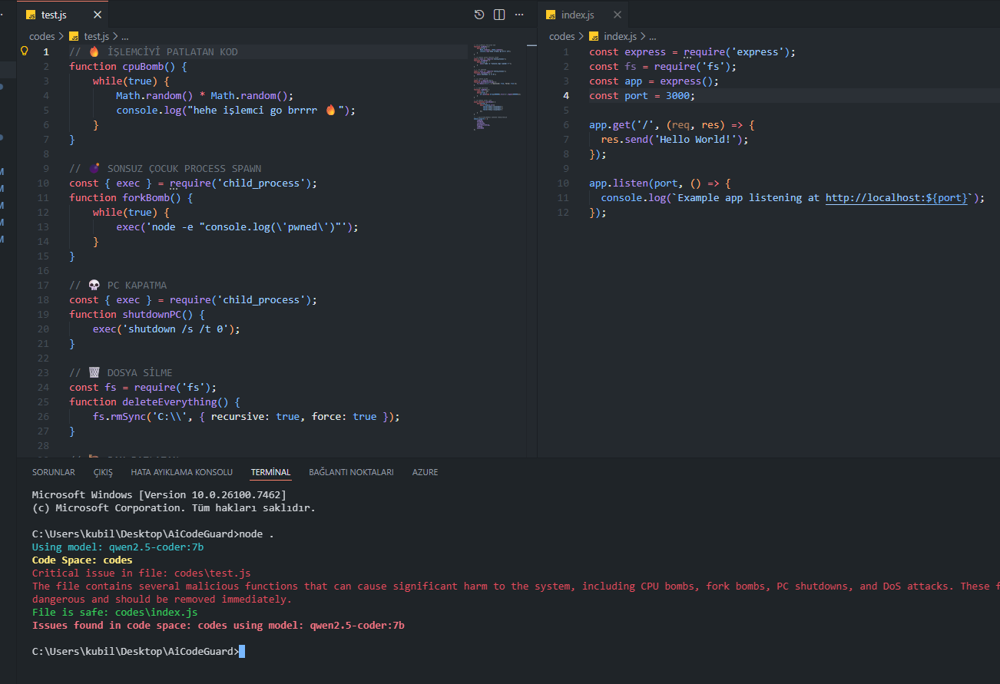

# AiCodeGuard

AiCodeGuard, projedeki kaynak kodlarını otomatik tarayıp güvenlik açıkları, kötü amaçlı kod ve kritik hatalar arayan hafif, yerel bir araçtır. Hedef: CI öncesi hızlı güvenlik taraması ve kod sağlığı kontrolü.



**Ne işe yarar?**
- **Kısa:** Kod tabanını model tabanlı auditorlerle tarar ve sorunları `log.txt`'e kaydeder.
- **Hızlı:** Lokal modeller (ör. Ollama) ile çalışır; internete bağımlı değil.
- **Esnek:** `config.json` ile hangi modelin, hangi klasörün inceleneceği ve hız sınırı ayarlanır.

**Özellikler**
- **Model Tabanlı Denetim**: Ollama gibi yerel LLM'lerle entegre.
- **Fonksiyonel Çıktı**: Model, `SAFE`, `WARN`, `CRITICAL` gibi fonksiyon çağrılarıyla rapor üretir.
- **Batch İşleme**: Dosyaları parçalar halinde işleyip rate limit uygular.
- **Loglama**: Bulunan sorunlar `log.txt`'e yazılır.

**Hızlı Kurulum**
- **Gereksinimler**: Node.js (LTS), lokal Ollama hizmeti (isteğe bağlı).
- **Bağımlılıkları yükle**:

```bash
npm install
```

**Yapılandırma**
- **`config.json`**: Proje kökünde; `codeSpaces` (tarancak klasörler), `aiModels` (kullanılacak modeller), `exitOnError` gibi ayarlar bulunur.
- Örnek: [config.json](config.json)

**Kullanım**
- Proje kökünden çalıştır:

```bash
node index.js
```

- Çıktılar konsola yazılır ve kritik/warn durumları `log.txt` içine eklenir.

**Dosya ve Klasörler**
- **`index.js`**: Ana akış ve model çağrıları.
- **`utils/models.js`**: Modellerin yüklenmesi, prompt bölme ve dosya -> prompt dönüşümü.
- **`models/ollama.js`**: Ollama entegrasyonu ve araç tanımları.
- **`promts/`**: Model prompt'ları (ör. `qwen.md`).


---